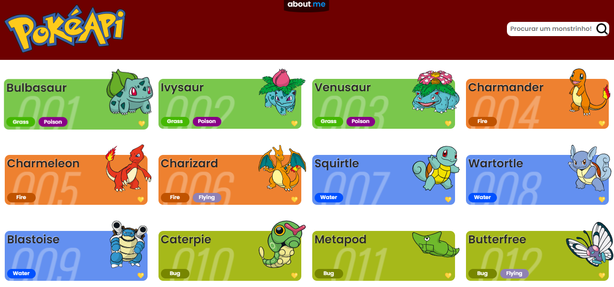
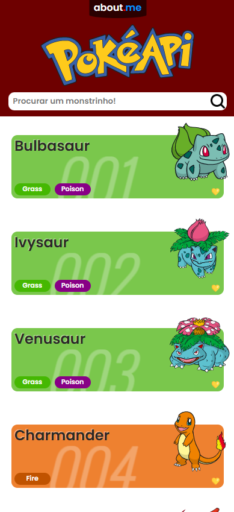
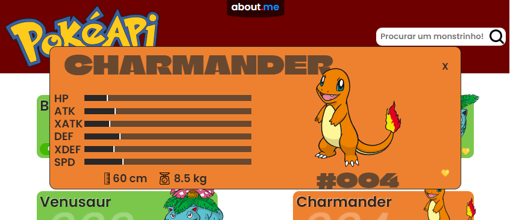
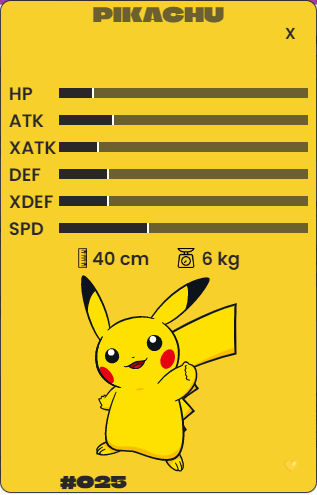
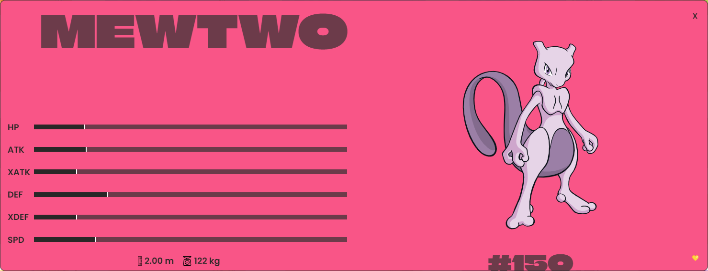

# Pokedex

O objetivo deste projeto é consumir a API gratuíta e retornar dados sobre pokemons.

Documentação da API disponível no link https://pokeapi.co/.

### Aprendizados

Neste projeto pude aprender e exercitar bastante sobre os Hooks useState, useEffect e useContext do ReactJS. Vários problemas de implementação e de lógica surgiram ao longo do desenvolvimento e desafiaram minha capacidade de resolver os problemas.

A linguagem Javascript foi muito utilizada e eu tive a oportunidade de praticar bastante expressões curto-circuito, ternários, IntersectionObserver, arrow functions, manipulação de array, de objetos e array de objetos.

### Funcionalidades

- Pokemons favoritos armazenados em LocalStorage
- Scroll infinito
- Card principal com dados de batalha, peso e altura
- Multiplataforma

### Acesso

https://brunoarrm.github.io/PokedexV2/
### Screenshots

  
  
  
  
  

### Feedback

Se você tiver alguma sugestão de melhoria eu terei prazer em saber, por favor, mande um email para bruno.arrm@gmail.com.

